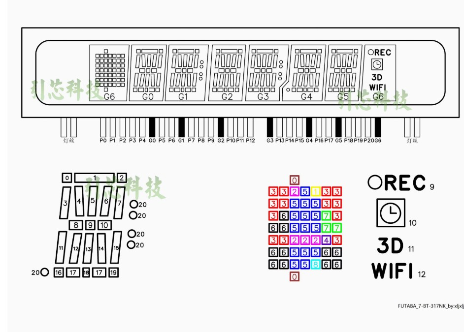
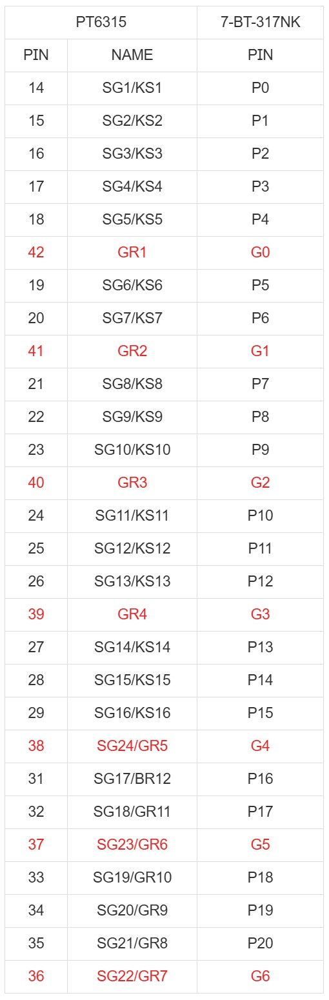

# MAX6921 VFD Arduino Driver Board

[English](README_EN.md) | 한국어

## 개요
아두이노를 사용하여 VFD(Vacuum Fluorescent Display)를 구동하는 범용 PCB 회로 제작 프로젝트입니다.

## 목표
- max6921 드라이버 칩을 사용한 VFD 구동 회로 설계 
- 아두이노와 호환되는 범용 PCB 보드 제작 
- 향후 다른 VFD 드라이버 칩 지원 확장 예정

## 주요 특징
- max6921 VFD 드라이버 칩 기반
- 아두이노 호환 인터페이스
- 범용적인 VFD 구동 솔루션
- **다중 MAX6921 칩 지원 (공통 제어 핀 사용)**
- **파워 드라이버 보드 별도 제거로 범용성 강화**

## 파워 드라이버

VFD의 파워는 2중으로 구성됩니다. 하나는 2~3V 수준의 저압의 필라멘트 구동용이며 AC로 구동되어야 화면 전체적으로 고른 밝기를 얻을 수 있고, 하나는 그리드와 세그먼트를 위한 고압이 필요합니다.

### 필라멘트용 저압 AC
필라멘트용 저압 AC는 LM1117 - NE555 - MX612 순으로 연결되어 작동합니다.
- **LM1117-ADJ**: 필라멘트에 맞는 전압을 생성
- **NE555**: 50% 듀티비의 PWM 신호를 생성
- **MX612**: 모터 드라이버를 이용해 스위칭하여 AC 전압을 생성

사용자가 원한다면 555 발진 회로를 제거하고 직접 MCU에서 PWM 신호를 넣을 수도 있습니다.

### 고압 DC
고압 DC는 **MC34063**을 이용했습니다.

### 전압 조정
LM1117-ADJ와 MC34063은 각각 회로도의 **FV-R**과 **HV-R**을 이용해 전압을 조정할 수 있습니다.

각각의 공식은 다음과 같습니다:
- 필라멘트 전압: $FV = 1.25(1+\frac{R5}{FVR})$
- 고전압: $HV = 1.25(1+\frac{HVR}{R1})$

## VFD 예제

1번 VFD (7BT317NK)

연결 테이블

## 라이선스
MIT License
